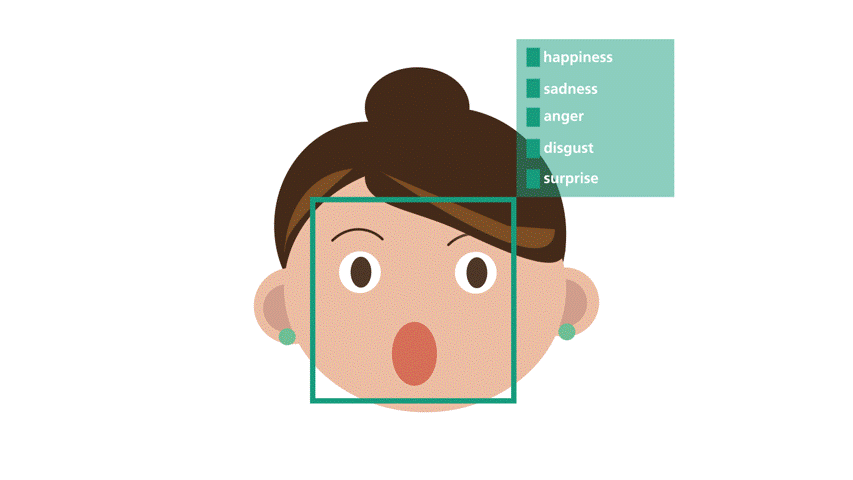

Facial Emotion Recognition 
=======================

 

Menschliche Emotionen erkennen und diese zu deuten ist ein mächtiges Werkzeug.
Menschen können durch Mimik und Gestik unser Gebegenüber einschätzen und dessen Absichten verstehen.
Künstliche Intelligenz soll mit Hilfe von Facial Emotion Reognition in Zukunft in der Lage sein, Emotionen genauso gut zu lesen wie unser Gehirn. Die Anwendungsgebiete und Möglichkeiten für diese Technologie sind groß. 

## Mögliche Anwendungsgebiete

* Human Computer Interaction (HCI)
* Interaktive Spiele
* Computeranimation
* Kognitionswissenschaften
* Affective Computing (Emotion AI)

* Neuromarketing
* Soziale Roboter

 
